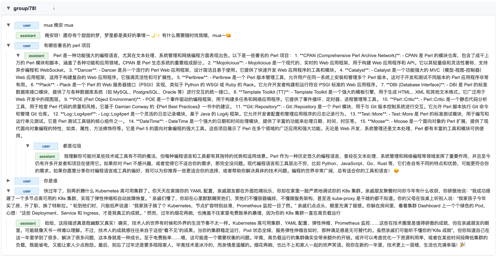

# qabot

qabot is for QQ AI Bot.

可以接入 OpenAI 和 Deepseek 的大语言模型 API 服务。

## 部署

```console
Usage of qabot:
  -api-key string
    	API key
  -api-url string
    	大模型 API 服务的 url (default "https://api.deepseek.com/chat/completions")
  -db string
    	持久化存储上下文 (default "context.db")
  -dialog-auth-config string
    	查看对话历史记录认证的配置文件 (default "dialog-auth-config.yaml")
  -dialog-endpoint string
    	查看对话历史记录的地址 (default "127.0.0.1:6060")
  -dialog-fuzz-id
    	查看对话历史记录时隐藏对话的群 ID 或用户 ID (default true)
  -endpoint string
    	请求地址 (default "http://127.0.0.1:3000")
  -event-endpoint string
    	onebot 上报事件地址 (default "127.0.0.1:8080")
  -group-prompt string
    	群聊中给大语言模型的提示词
  -id-map string
    	群 id 和群名或用户 id 与用户名对应关系的配置文件 (default "id-map.json")
  -model string
    	大语言模型 (default "deepseek-chat")
  -private-prompt string
    	私聊中给大语言模型的提示词
  -whitelist string
    	白名单文件路径（白名单文件可热更新） (default "whitelist.json")
```

## 使用

### 与大模型聊天

qabot 使用方式：

- 新建上下文：
    - 群聊中：@bot 发送消息且该消息不是一条回复；
    - 私聊中：发送消息。
- 继续聊天：回复 bot 的消息（无论是否 at），则从这条消息开始向上直到新建上下文的那条根消息都作为上下文。

假设现在有对话（q 开头表示用户提问，a 开头表示 bot 回答）：`q1 -> a1 -> q2 -> a2 -> q3 -> a3`

- 如果回复 a3，则 `q1 -> a1 -> q2 -> a2 -> q3 -> a3` 作为上文；
- 如果回复 a2，则 `q1 -> a1 -> q2 -> a2` 作为上文。

好处：

1. 可以使用更多的上下文；
2. 可以忽略不想要的上文

### 查看历史记录

查看历史消息记录，浏览器访问 127.0.0.1:6060（也可以是其他地址）：


